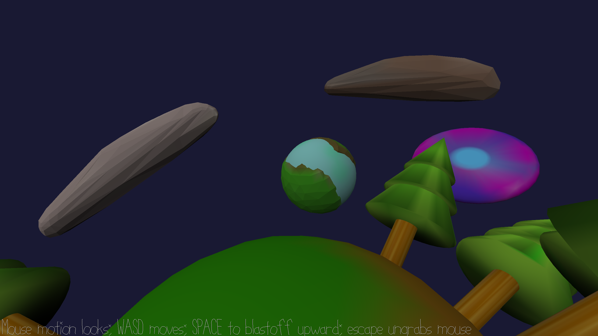

# Galaxy

Author: Matei Budiu

Design: Galaxy is a game in which the player can walk around planets and jump between them

Screen Shot:

How To Play:

Move around with WASD and look around with the mouse. Press the space bar to blast off into space - you can look straight up
to see the direction in which you will blast off (it depends on the normal of the ground you are on).

If you make contact with a planet, you will stick to it. Otherwise, if you miss and fly for 10 seconds, the game will
automatically put you back on the nearest planet to you.

There is no explicit goal, just fly around and explore :)

Sources: All assets were made by me, and some code was inspired by that shared in class. See the code for specific citations.

This game was built with [NEST](NEST.md).

